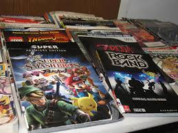
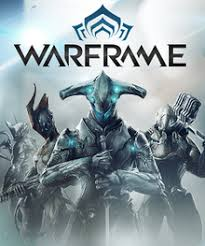

<!DOCTYPE HTML>
<html>
<head>
<Title> Video Game Guides </title>
<meta name="description" content="What are game guides?">
<meta name="keywords" content="game, guides, gaming, gamer, gaming help, game help, game guides, guide,">

       
</head>
<body>

<h1></h1>

 This topic is very interesting, it can help many new and sometimes veteran players with things they might need to know.
These guides will also be helpful for other types of games, and can be used in a variety of different of situations.
<a href="http://www.ign.com"> Visit IGN to see an example of game guides. </a> <a href="https://guides.gamepressure.com"> This is another example of a website with many game guides </a>

<blockquote> "It's very difficult for people who don't play video games to understand their power simply by watching, and it's very difficult for people who aren't close to technology to understand how rapidly it can change whatever it touches." - Bing Gordon </blockquote>

 Did you know about how helpful these guides can be? Guides are useful for players that are stuck or cant figure out something in a particular game. I enjoy making these guides because it makes information more accesible to more people

These guides can be very hard to come across and are very helpful when people do find them if they are stuck or need help with something.</pr>

</body>
</html>
